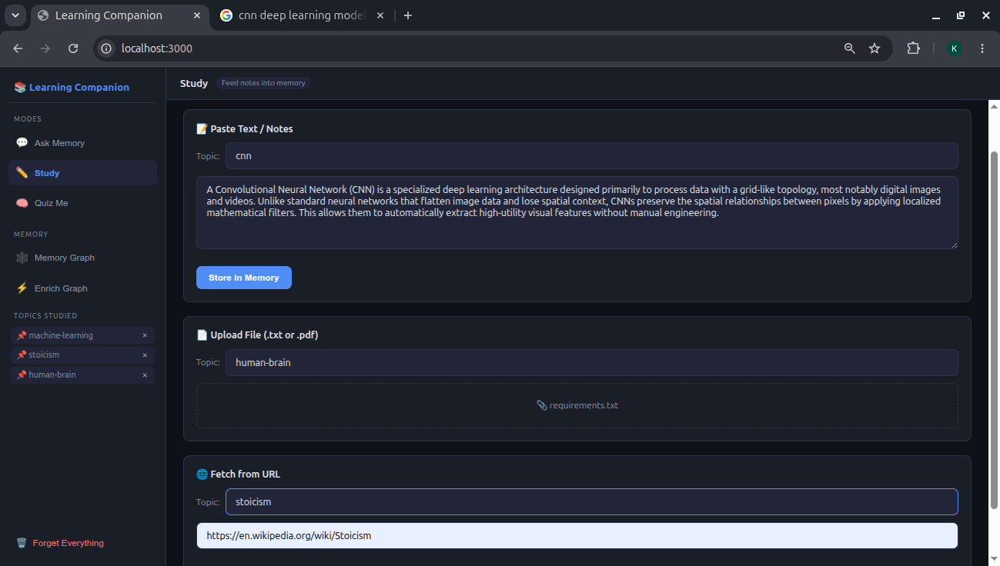
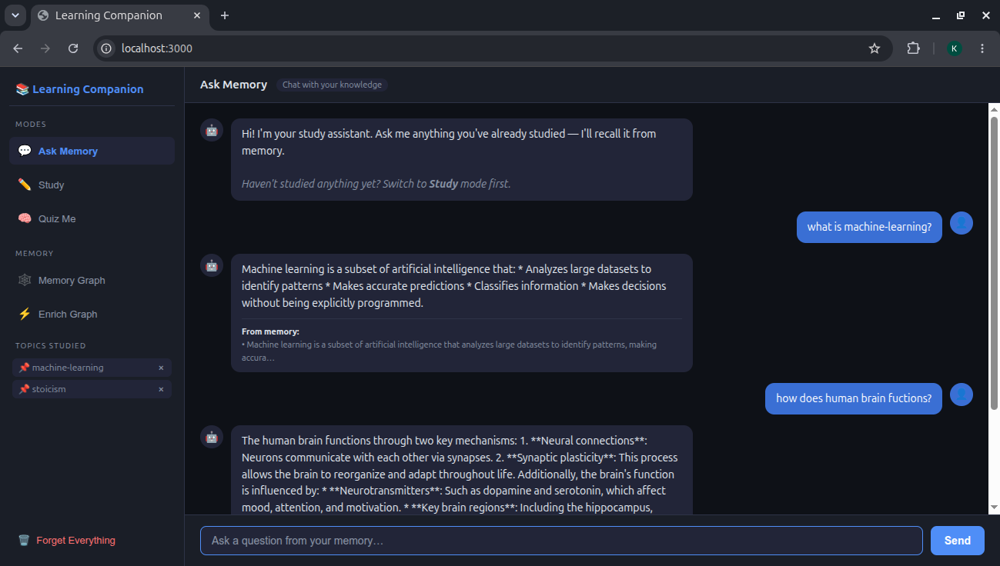
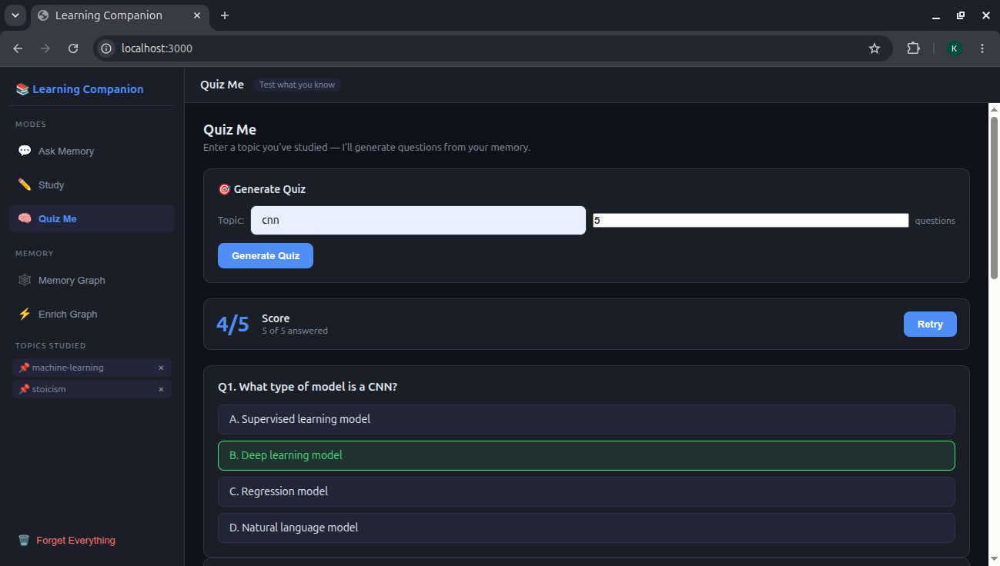
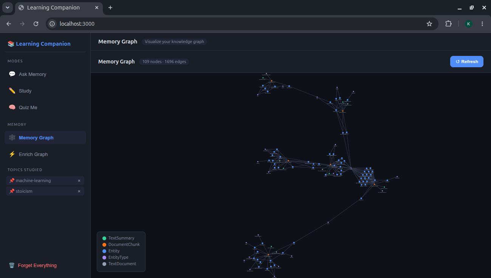

# 📚 Learning Companion


> A personal AI study assistant powered by **Cognee's persistent memory layer** — study anything, ask questions, take quizzes, and watch your knowledge graph grow.

**By Kartik Sonawane** — built for the **WeMakeDevs × Cognee Hackathon** ("The Hangover Part AI: Where's My Context?", June 29 – July 5, 2026).

---

## Demo

**Study — feed notes in via text, file upload, or URL**


**Ask Memory — grounded Q&A over what you've studied**


**Quiz Me — auto-generated MCQs with scoring**


**Memory Graph — the knowledge graph, growing with every topic**

*The D3.js force-directed memory graph, built from `cognee.export()` — nodes are entities, documents, and chunks; edges are the relationships Cognee inferred.*

---

## What it does

Learning Companion turns your study notes into a living knowledge graph. Unlike a chatbot that forgets everything after each session, it **remembers** what you've studied and builds relationships between concepts.

| Feature | Description |
|---|---|
| **Study** | Paste text, upload a PDF/TXT, or fetch a URL — Cognee stores it permanently |
| **Ask Memory** | Ask questions about what you've studied — answers are grounded in your notes |
| **Quiz Me** | Auto-generated MCQ quiz from your stored memory on any topic |
| **Memory Graph** | D3.js force-directed visualization of your knowledge graph |
| **Topic Management** | Track and selectively forget individual topics |
| **Enrich Graph** | Deepen connections between concepts with one click (`cognee.improve()`) |

---

## Architecture

```
Browser (Single-page HTML + D3.js)
        │
        │  REST / SSE
        ▼
FastAPI Backend (port 8001)
  ├── /study/text|file|url   → cognee.remember()
  ├── /ask                   → cognee.recall() + Groq LLM (streaming SSE)
  ├── /quiz                  → cognee.recall() + Groq LLM (MCQ JSON)
  ├── /graph                 → cognee.export() → D3-ready {nodes, links}
  ├── /improve               → cognee.improve()
  └── /forget                → cognee.forget()
        │
        ▼
Cognee Memory Layer
  ├── Graph DB  (Kuzu/Ladybug — local file)
  ├── Vector DB (local)
  └── Embeddings: Fastembed (sentence-transformers/all-MiniLM-L6-v2, local CPU)
        │
        ▼
Groq API (llama-3.3-70b-versatile) — LLM inference
```

**Key design choice:** Using `cognee.export()` instead of `get_graph_engine()` to read the graph — this reuses the existing DB connection and avoids file-lock conflicts.

---

## Setup

### Prerequisites

- Python 3.11+
- [Groq API key](https://console.groq.com/keys) (free tier works)
- No GPU needed — Fastembed runs on CPU

### Install

```bash
git clone <repo-url>
cd hackathon

python3 -m venv venv
source venv/bin/activate          # Windows: venv\Scripts\activate

pip install -r requirements.txt
```

### Configure

Copy `.env.example` to `.env` and add your Groq key:

```bash
cp .env.example .env
# Edit .env and set LLM_API_KEY=gsk_...
```

`.env` contents:
```
LLM_PROVIDER="custom"
LLM_MODEL="groq/llama-3.3-70b-versatile"
LLM_API_KEY="your-groq-api-key"

EMBEDDING_PROVIDER="fastembed"
EMBEDDING_MODEL="sentence-transformers/all-MiniLM-L6-v2"
EMBEDDING_DIMENSIONS="384"

ENABLE_BACKEND_ACCESS_CONTROL=false
COGNEE_SKIP_CONNECTION_TEST=true
```

### Run

**Terminal 1 — Backend:**
```bash
source venv/bin/activate
uvicorn backend.main:app --reload --port 8001
```

**Terminal 2 — Frontend:**
```bash
cd frontend
python3 -m http.server 3000
```

Open **http://localhost:3000** in your browser.

---

## Usage

1. **Study something** — paste notes in the Study tab, upload a PDF, or paste a Wikipedia URL
2. **Ask questions** — switch to Ask Memory and ask about what you studied
3. **Take a quiz** — enter a topic name (must match what you studied) and hit Generate
4. **Explore the graph** — click Memory Graph to see your knowledge visualized
5. **Enrich connections** — click ⚡ Enrich Graph in the sidebar to deepen relationships

---

## Project structure

```
hackathon/
├── backend/
│   ├── main.py                  # FastAPI app
│   ├── routes/
│   │   ├── ask.py               # /ask   — streaming SSE
│   │   ├── quiz.py              # /quiz
│   │   ├── study.py             # /study/text|file|url
│   │   ├── improve.py           # /improve
│   │   ├── forget.py            # /forget
│   │   └── graph.py             # /graph — knowledge graph export
│   └── services/
│       └── memory.py            # Cognee wrapper (remember/recall/improve/forget)
├── frontend/
│   └── index.html               # Single-page app (vanilla JS + D3.js)
├── .env                         # Secrets (not committed)
├── .env.example
└── requirements.txt
```

---

## Cognee APIs used

| Cognee API | Used for |
|---|---|
| `cognee.remember(text, dataset_name=topic)` | Ingest notes into the graph |
| `cognee.recall(query_text=question)` | Semantic + graph search |
| `cognee.improve(dataset=topic)` | Deepen graph connections |
| `cognee.forget(everything=True / dataset=topic)` | Erase memory |
| `cognee.export(format="pydantic")` | Read graph nodes/edges for visualization |

---

## Memory Graph visualization

The graph endpoint (`GET /graph`) calls `cognee.export()` which returns a `GraphSnapshot` — a typed Pydantic object with `.nodes` and `.edges`. These are transformed into a D3-friendly `{nodes, links}` payload and rendered as a force-directed graph with:

- **Color coding** by node type (Entity, DocumentChunk, TextDocument, etc.)
- **Drag** individual nodes to explore
- **Zoom / pan** the full graph
- **Hover tooltips** showing node type and label
- **Edge labels** showing relationship names

---

## Tech stack

| Layer | Technology |
|---|---|
| Memory | Cognee v1.2+ |
| LLM | Groq (llama-3.3-70b-versatile) |
| Embeddings | Fastembed (all-MiniLM-L6-v2, local) |
| Backend | FastAPI + uvicorn |
| Frontend | Vanilla HTML/CSS/JS |
| Graph viz | D3.js v7 |

---

## About

Built by Kartik Sonawane for the [WeMakeDevs × Cognee Hackathon](https://www.wemakedevs.org/hackathons/cognee) (June 29 – July 5, 2026).

---

## AI-assistant disclosure

Per the hackathon rules, disclosing AI assistant use is required. Claude was used during development to help with code scaffolding, debugging, and documentation (including this README). All architecture decisions, the Cognee integration design, and testing were done by the author.

---

## License

[MIT](LICENSE)
